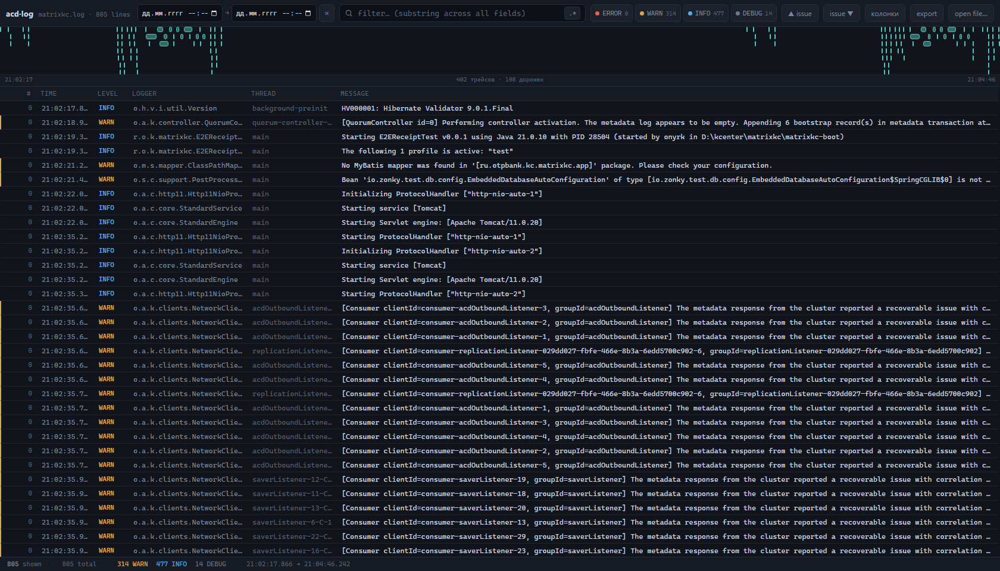
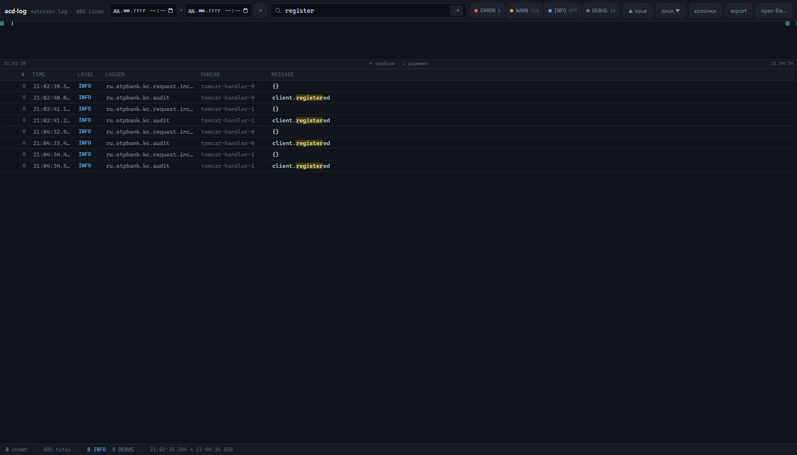
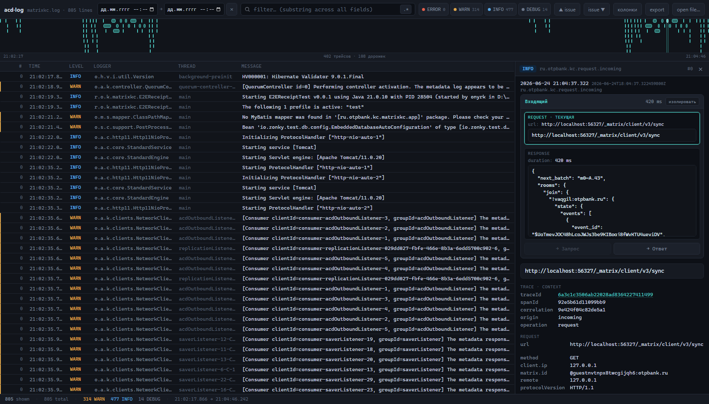

# log-viewer

Однофайловый просмотрщик ECS JSON-lines (ndjson) логов — таких, какие отдаёт Spring Boot
(logback → ECS через `FormatterElastic`). Без сборки, без сервера, без зависимостей и без
обращений в сеть: открывается прямо как `file://`.

**Онлайн:** https://olegnyr.github.io/logviewer/

## Как открыть

Есть три способа загрузить лог — выбирайте любой:

- **Перетащите** `.log` / `.ndjson` файл прямо на страницу.
- Нажмите **«open file…»** и выберите один или несколько файлов.
- Скопируйте ndjson в буфер и нажмите **Ctrl/Cmd + V** прямо на странице.

Можно открыть и локально: скачайте `log-viewer.html` и откройте двойным кликом в браузере —
всё работает офлайн, данные никуда не уходят.

## Обзор интерфейса



Сверху вниз:

- **Тулбар** — имя файла и число строк, интервал по времени (два поля «дд.мм.гггг чч:мм»),
  строка поиска, переключатель регулярного выражения **`.*`**, кнопки уровней
  (ERROR / WARN / INFO / DEBUG со счётчиками), навигация **▲ issue / issue ▼**,
  **колонки**, **export**, **open file…**.
- **Таймлайн** — полоска спанов трейсов под тулбаром (см. ниже).
- **Список** — виртуализированная таблица: `#`, время, уровень, логгер, поток, сообщение.
- **Статусбар** — сколько строк показано из общего числа, разбивка по уровням и
  временной диапазон выборки.

## Поиск и фильтры



- **Строка поиска** — подстрока по всем полям записи; совпадения подсвечиваются.
  Кнопка **`.*`** переключает в режим регулярного выражения.
- **Уровни** — клик по кнопке ERROR/WARN/INFO/DEBUG включает или выключает уровень.
- **▲ issue / issue ▼** (или **Shift+P / Shift+N**) — прыжок к предыдущему / следующему
  WARN или ERROR.
- **Интервал по времени** — два поля даты-времени в тулбаре; записи вне интервала
  скрываются. Интервал также можно «протянуть» мышью прямо по таймлайну.
- Любой активный фильтр показывается **чипом** под тулбаром — кликом по **×** он снимается.

## Детальная панель и «Обмен»



Клик по строке открывает справа детальную панель: время, логгер, сообщение,
трейс/контекст, заголовки запроса, процесс, ошибка со стектрейсом и сырой JSON.

Если у записи есть `correlation` (пара запрос↔ответ), наверху панели появляется блок
**«Обмен»** — он группирует записи одной корреляции на стороны *запрос* и *ответ*
(входящий/исходящий определяется по `origin` запроса) и даёт кнопки навигации между ними.

В каждой строке `поле: значение` детальной панели есть две кнопки:

- **▦** — добавить это поле как **колонку** в список (поддерживаются вложенные пути,
  например `header.key`, `process.thread.name`, `error.type`).
- **⊕** — добавить **фильтр** `поле = значение`.

Кликабельные значения (`traceId`, логгер, поток) сразу ставят соответствующий фильтр.

## Таймлайн

Полоска над списком рисует спаны трейсов. Гранулярность **адаптивная**: пока в выборке
много трейсов — бары группируются по `traceId`; если отфильтровать один трейс — по `spanId`;
один спан — один бар на запись.

- **Клик** по бару — перейти к этому трейсу/записи.
- **Протянуть** мышью область — задать интервал по времени (он же появится в полях тулбара).

## Колонки

Кнопка **«колонки»** показывает поповер со списком ключей верхнего уровня — отметьте нужные,
чтобы добавить их колонками. Колонки можно перетаскивать за правый край заголовка, чтобы
менять ширину. Быстрее всего добавить вложенное поле кнопкой **▦** в детальной панели.

## Экспорт

**export** скачивает текущую отфильтрованную выборку как ndjson — удобно вырезать из
большого дампа только нужные записи.

## Горячие клавиши

| Клавиша | Действие |
|---|---|
| `/` | фокус в строку поиска |
| `↓` / `j`, `↑` / `k` | следующая / предыдущая строка |
| `Shift+N` / `Shift+P` | следующий / предыдущий WARN·ERROR |
| `Esc` | снять текущий фильтр / закрыть детальную панель |
| `Ctrl/Cmd + V` | вставить ndjson из буфера |

## Разработка

`log-viewer.html` — **собираемый артефакт**, руками его не правят. Исходники лежат в `src/`:

```
src/
  index.html     — HTML-каркас с маркерами /*@build:styles@*/ и /*@build:script@*/
  styles.css     — все стили
  js/
    05-state.js
    10-field-extraction.js
    …
    95-resizable-detail-panel.js
build.js          — сборка
```

Фрагменты `src/js/*.js` склеиваются **в порядке имён** внутрь одного IIFE (общий
closure сохраняется, никаких ES-модулей). Сборка — чистый Node, без зависимостей:

```sh
node build.js      # src/ -> log-viewer.html
```

Собранный `log-viewer.html` коммитится в репозиторий, чтобы GitHub Pages отдавал его
без шага сборки. После правок в `src/` — пересоберите и закоммитьте оба изменения вместе.

## Схема логов

Логи приходят из `FormatterElastic` (logback → ECS). Подробности о полях
(`@timestamp`, `level`, `logger`, `process.thread.name`, `error.*`, MDC vs KeyValuePairs,
`correlation` vs `traceId`) описаны в [CLAUDE.md](CLAUDE.md).
